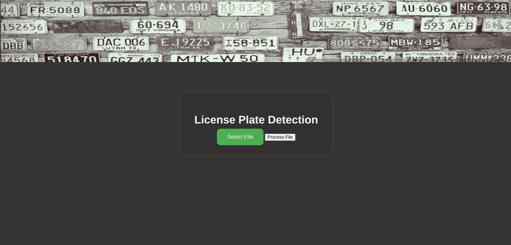
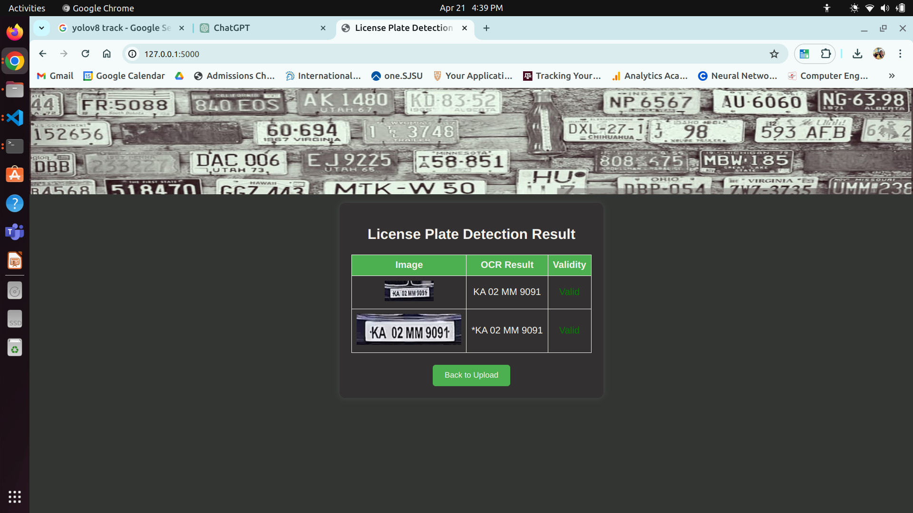
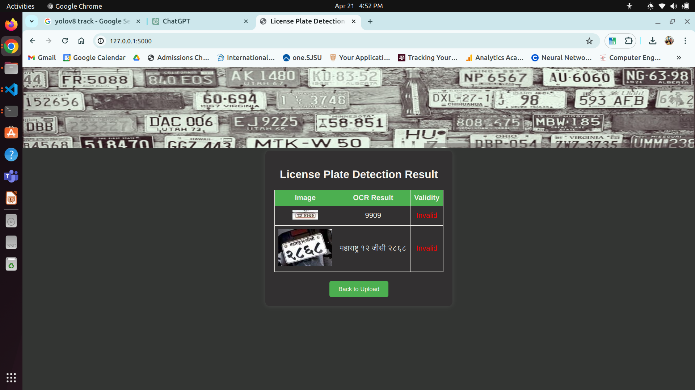

# PLATE PERFECT - Automatic Recognition of Non-Standard Number Plates using Yolov8 - image + video support

## Description

Detection of Number Plate using the robust and state-of-art Yolov8 model, latest in the Yolo series which is trained specially on the Indian Lisence Plates. Recognition is facilitated by the Google Vision API that offers multi-lingual support enabling accurate identification of the non-standard text that is illegaly included on the Lisence Plates. Additionally, a Flask API has been integrated offering scalability.

## Steps for implementation

1. **Clone the repository locally:**

    ```bash
    git clone https://github.com/itsRenuka22/plate-perfect.git
    ```
  
    Git CheatSheet for git help: https://docs.google.com/document/d/1k16_CxP0rzVt2fje0z0geZ5SYgDaD2lnRaD5fZ2VpFs/edit?usp=sharing

2. **Create Python3.10 virtual environment(venv) and activate it**
  
      ```bash
      python3.10 -m venv .venv
      source .venv/bin/activate
    ```

3. **Create Google Vision API key and add to .venv**  

      ```bash
      follow link:
      # https://www.youtube.com/watch?v=wfyDiLMGqDM
    ```

4. **Install requirements**

      ```bash
      pip install ultralytics
      pip install -r requirements.txt
    ```

5. **Create following empty folders**

      ```bash
      check2
      distinct_ocr
      uploads
      ```

4. **Change paths**

      ```bash
      Update the paths inside the code as per your system. Locations where paths are to be changed are marked.
    ```

5. **Execute**

      ```bash
      python3 app.py
    ```

**Input:**
- An image or video file.

### Example

**Front end**


**Valid LP**


**Invalid LP**


